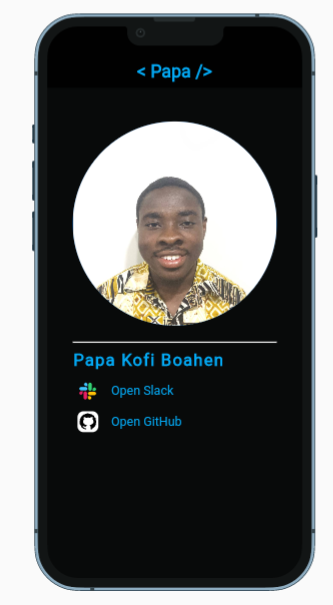
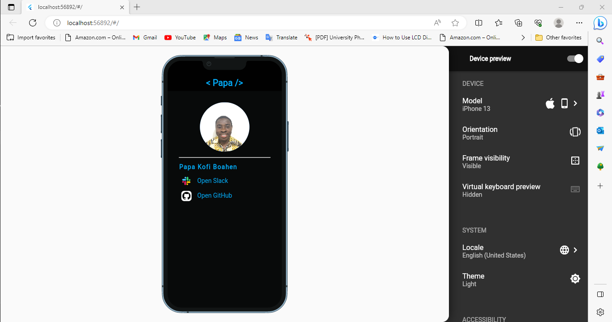
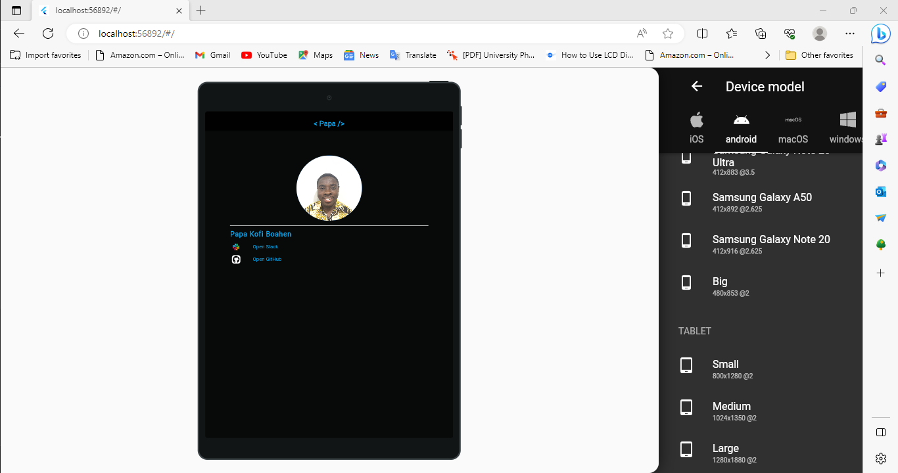

# Papa Kofi's Personal Details

Access my GitHub Profile using this app built with flutter. The app also features my picture.

## Overview

This app displays two buttons. One to access my HNGx slack profile and the other to access my GitHub  
profile.

# Screenshot

 
  

# Setup Instructions

- Ensure you have **flutter SDK** installed. Check the official documentation for [system requirements](https://docs.flutter.dev/get-started/install/windows#:~:text=System%20requirements,-To%20install%20and&text=Operating%20Systems%3A%20Windows%2010%20or,being%20available%20in%20your%20environment.&text=Git%20for%20Windows%202.x,the%20Windows%20Command%20Prompt%20option.)
- Clone this repository to your local workstation
- Issue flutter run in your terminal, making sure to start an android emulator or by connecting to a physical android device.

# The app is Responsive

To inspect the app's UI on various devices the [Device Preview](https://pub.dev/packages/device_preview) plugin is used.

### UI on Iphone 13

 
  

### UI on Samsung S20

 

### UI on a tablet

 

 

[online documentation - flutter.dev](https://docs.flutter.dev/)
